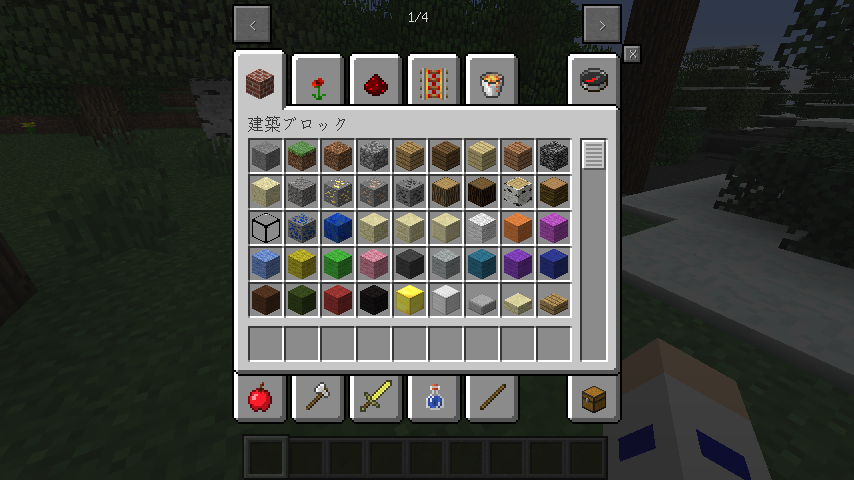

# CreativeGui
  
Creative tabs like Minecraft 1.4.7 for Minecraft 1.2.5.  
This mod is made for Minecraft 1.2.5 with Minecraft Forge and Minecraft API.  

Minecraft 1.4.7のようなMinecraft 1.2.5用のクリエイティブタブ。  
このModはMinecraft ForgeとMinecraft APIが導入済みのMinecraft 1.2.5向けに作られています。  

# Required mods - 前提MOD
* [MinecraftForge 1.2.5 - 3.4.9.171](https://files.minecraftforge.net/net/minecraftforge/forge/index_1.2.5.html)
* [Minecraft API latest](http://minecraft125user.nisfan.net/forum/viewtopic.php?f=11&t=133)

# How to build - ビルド方法
EN
1. Setup Minecraft Forge SDK.
1. Download source and place src folder to Forge folder.
1. Run recompile and reobfuscate
1. Zip reobf/minecraft/CreativeGui folder

JP
1. Minecraft Forge SDKをセットアップします。
1. ソースコードをダウンロードしてsrcフォルダをForgeのフォルダ内に配置します。
1. recompileとreobfuscateを実行します。
1. reobf/minecraft/CreativeGuiフォルダをzipファイルに圧縮します。

# Packages - パッケージ
EN
* CreativeGui - This is main source code.
* minecraftAPI - This is made for compile. This is not included Minecraft API source code.

JP
* CreativeGui - メインのソースコードです。
* minecraftAPI - これはコンパイル用です。Minecraft APIのソースコードは含まれていません。

# Config - コンフィグ
## config/mod_CreativeGui.cfg
```
addAllBlocks=true
idSearch=true
loreSearch=true
unlocalizedNameSearch=true
modNameSearch=true
addonMode=true
uniteSize=10
uniteTabs=false
```

* addAllBlocks
  * Whether or not to display items that cannot be acquired in the creative mode without commands and mods.
  * クリエイティブの画面で取得できないアイテムを表示するようにするかどうか。  
* idSearch
  * Whether or not to enable numeric id search.
  * 数字ID検索を有効にするかどうか。  
* loreSearch
  * Whether or not to enable item information search.
  * 説明文検索を有効にするかどうか。  
* unlocalizedNameSearch
  * Whether or not to enable search using UnlocalizedName. If you use English in Minecraft, recommend false.
  * UnlocalizedNameを使用した検索を有効にするかどうか。言語設定が英語の人はfalse推奨。  
* modNameSearch
  * Whether or not to enable mod name search.
  * Mod名検索を有効にするかどうか。  
* addonMode
  * Whether or not to combine addons and parent mods. Default is true. If you set false, it is disabled, but tabs are increased.
  * アドオンを親MODと同じタブにまとめるかどうか。デフォルトはtrue。falseにすれば無効化できるが、タブの数が増えてしまう。  
* uniteSize
  * If the number of items in a tab is less than or equal to the specified number, it will be grouped into one tab. With the default setting of 10, if there are less than 10 items in a tab, they will be grouped in the Mods tab.
  * タブ内のアイテムが指定数以下だと1つのタブにまとまるようになる。デフォルトの10だとタブの中のアイテムが10個以下だとModsタブにまとめられる。  
* uniteTabs
  * Whether or not to group items into Mods tab. If it is set false, there is no Mods tab.
  * アイテムの少ないタブをModsタブにまとめるかどうか。falseだとModsタブは存在しない。  
## CreativeGui/*.cfg
CreativeGui's own config.  
This config can be used to properly separate add-ons, or to set mod items to be placed in a tab on the first page.  
The file name is free, but it must end with .cfg.  
Just put the cfg file in the CreativeGui folder and it will read it.  

CreativeGui独自のコンフィグ。  
このコンフィグを使うことでアドオンを正しく分けることができたり、MODのアイテムを1ページ目のタブの中に入れるように設定ができたりする。  
ファイル名は自由で、最後が.cfgでないといけない。  
CreativeGuiフォルダの中にcfgファイルを入れれば読み込んでくれる。  

```
AddonDictionary
#IC2
mod_CompactSolars=mod_IC2
IdDictionary
item.ps125.carrot=5
tile.ps125(start)=0
204=1
```

### #IC2
If the line starts with #, it means the line is comment.
#から始まる行はコメントとなる。
### AddonDictionary
Specifies the parent mod of the mod. This is used when judging add-ons.  
Mod name = parent mod name  
To tell that a mod is the parent, just leave the parent mod name blank.  
The mod name is the name you see in the Minecraft mod list.  

Modの親Modを指定する。アドオンの判定のときに使われる。  
Mod名=親Mod名  
と設定する。Modが親だと教えるには親Mod名を空白にすれば良い。  
Mod名はMinecraftのMod一覧に書いてある名前。  

### IdDictionary
You can move mod items into a specific tab.  
For example, MultiPageChest can be placed in the decoration block tab.  
UnlocalizedName=TabID  
ID=TabID  
The UnlocalizedName is the name of the item before the translation is applied, and is set for all available items. Note that it is different for each metadata.  
If you specify UnlocalizedName(start), you will be taken to the specified tab if the item starts with the specified UnlocalizedName.  
You can easily find out the UnlocalizedName by using IDwakander.  
The ID is set as a numeric ID.  
For example, if you write tile.ps125.dropper=2 and then tile.ps125(start)=0, only one item will go to the Redstone tab and the rest will go to the Building tab.  

MODのアイテムを特定のタブの中に移動させられる。  
例えばMultiPageChestを装飾ブロックタブに入れるようにすることができる。  
UnlocalizedName=TabID  
ID=TabID  
上のような指定ができる。UnlocalizedNameとは翻訳が適応される前の名前で、手に入るアイテムなら全てに設定されている。メタデータごとに違うことに注意。  
UnlocalizedName(start)と指定すれば指定したUnlocalizedNameから始まるアイテムであれば指定したタブへ移動する。  
UnlocalizedNameはIDwakanderを使えば簡単に調べることができる。  
IDは数字のIDで設定。  
そして、アイテムの判断は上から順に行われるので、例えばtile.ps125.dropper=2と書いたあとにtile.ps125(start)=0としておけば、一つだけレッドストーンタブに入り、残りは建築タブに入る様になる。  

TabID is the ID of the tab, starting at the top left of the first page, number 0, moving one to the right, number 1... When you get to the rightmost one, move down to the left, number 5... and so on. and so on. Vanilla tabs are numbered from 0 to 9, and other IDs can be specified, but do not use them as they will change depending on the amount of mods.

TabIDはタブのIDで、1ページ目の左上から0番、右に一つ移動して1番...一番右に来たら左下へ移動して5番...と続く。バニラのタブは0～9番まであり、それ以外のIDも指定できるがMODの量によって変わってしまうので使わないように。  